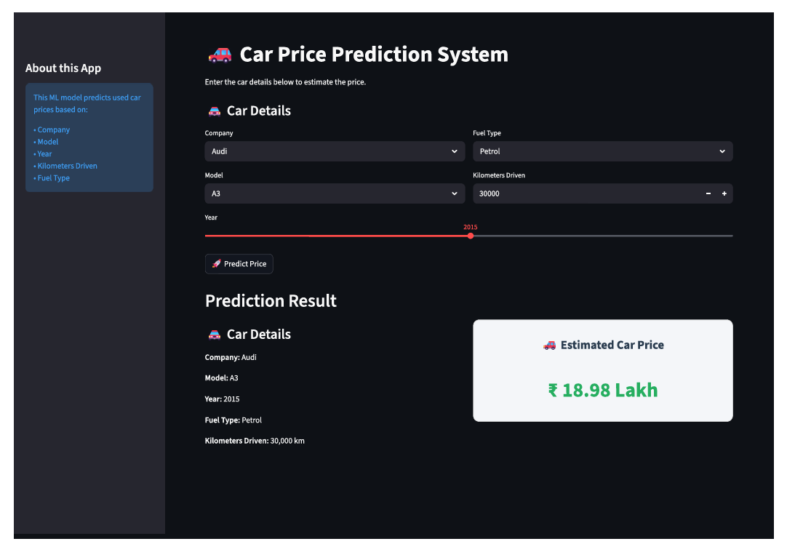

# 🚗 Car Price Prediction System

This project builds a **Machine Learning regression model** to predict the **selling price of a used car** based on its specifications.

The project also includes a **Streamlit web application** that allows users to interactively predict car prices through a simple interface.

---

# 📌 Project Overview

The model analyzes several features of a car such as:

- Company
- Model
- Manufacturing Year
- Kilometers Driven
- Fuel Type

Using these inputs, the model predicts the **estimated market price of the car**.

---

# 📊 Dataset

The dataset used in this project contains information about used cars listed for sale.

Dataset file:

    quikr_car.csv

### Features

| Feature | Description |
|------|------|
| Company | Brand of the car |
| Model | Specific car model |
| Year | Manufacturing year |
| Kms Driven | Total kilometers driven |
| Fuel Type | Petrol / Diesel / CNG |

### Target Variable

| Feature | Description |
|------|------|
| Price | Selling price of the car |

---

# 🧠 Machine Learning Models

Two regression models were trained:

- **Linear Regression**
- **Random Forest Regressor**

### Model Performance

| Model | R² Score |
|------|------|
| Linear Regression | **0.82** |
| Random Forest | 0.67 |

Linear Regression performed better and was selected as the **final model**.

The trained model was saved as:

    car_price_model.pkl

---
## 📷 Application Preview

# 🔮 Example Prediction

Example input:

    Company: Honda
    Model: City
    Year: 2014
    Kms Driven: 45000
    Fuel Type: Diesel

Predicted Price:

    ₹3,49,015 (approximately)

---

# 🌐 Streamlit Web Application

The project includes a **Streamlit application** where users can enter car details and instantly get a predicted price.

To run the app locally:

streamlit run app.py

---

# 📂 Project Structure

    Car Price Prediction
    │
    ├── app.py 
    ├── car-price-predictor.ipynb 
    ├── car_price_model.pkl 
    ├── quikr_car.csv 
    ├── requirements.txt 
    ├── README.md 
    └── .gitignore 

---

# 🛠️ Libraries Used

- Python
- Pandas
- NumPy
- Scikit-Learn
- Streamlit
- Jupyter Notebook

---

# ⚙️ Installation

Clone the repository:

git clone https://github.com/Mrinmoy5-rgb/Machine-Learning-Projects/tree/main/INTERNPE_Machine_Learning_Internship/car-price-prediction

Install dependencies:

pip install -r requirements.txt

Run the Streamlit app:

streamlit run app.py

Use the App:

https://mrinmoy-7-car-price-prediction.streamlit.app

---

# 🚀 Future Improvements

- Add car image preview
- Improve UI design
- Add data visualization
- Deploy the app online

---

# 👨‍💻 Author

**Mrinmoy Debnath**  
Machine Learning Enthusiast

GitHub:  
https://github.com/Mrinmoy5-rgb